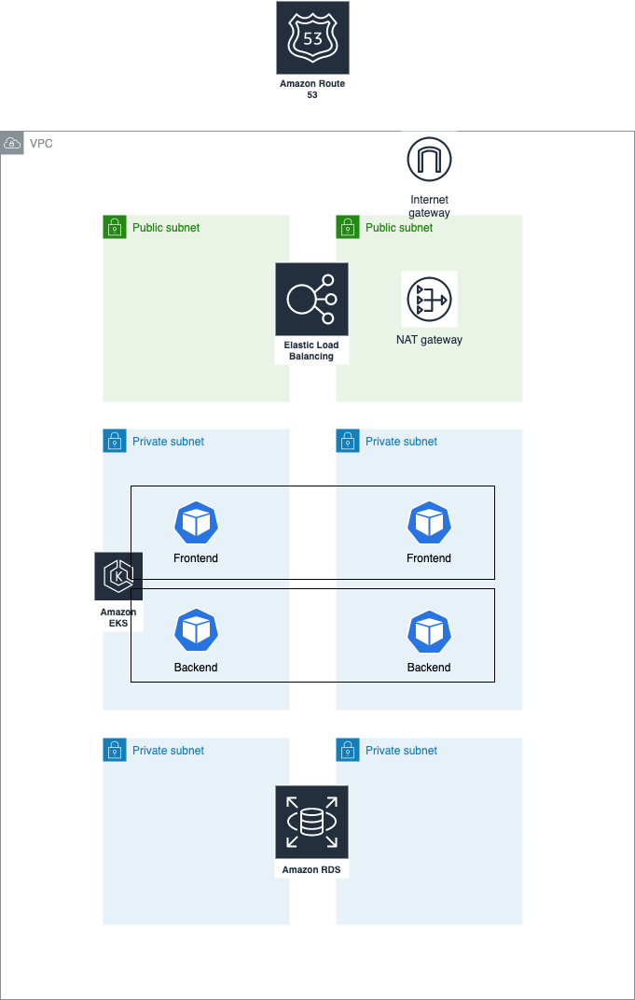

# Kubernetes Fullstack Node.js
Imagine a Node.js application that is carefully deployed on Minikube and managed by Kubernetes. This setup includes a strong backend, a nice frontend, and a PostgreSQL database, all working together to meet the needs of users.

## Description of Kubernetes Resources

### Database
- **Deployment (`database`)**: Deploys PostgreSQL (`postgres:14` image) database with initialization from `init.sql` using a `ConfigMap`. It mounts `database-volume-claim` for persistent storage of PostgreSQL data.
- **Service (`database-service`)**: Provides a stable endpoint (`database.development.svc.cluster.local`) for accessing the PostgresSQL database (`postgres` Deployment) internally within the Kubernetes cluster.
- **ConfigMap (`database-init`)**: Contains `init.sql` script that initializes the database schema (`users` table) upon PostgreSQL container startup.
- **Secret (`database-secret`)**: Stores sensitive information such as PostgreSQL credentials (`POSTGRES_USER`, `POSTGRES_PASSWORD`, `POSTGRES_DB`) encoded in base64.
- **PersistentVolume**: Provides storage for PostgreSQL data.​
- **PersistentVolumeClaim (`database-volume-claim`)**: Requests persistent storage for storing PostgreSQL data (`/var/lib/postgresql/data`).

### Backend
- **Deployment (`backend`)**: Manages the backend application (`backend:dev` image) responsible for serving requests from the web browser and interacting with the database. It pulls PostgreSQL credentials from `database-secret` for database connectivity.
- **Service (`backend-service`)**: Provides a stable endpoint (`backend.development.svc.cluster.local`) for accessing the backend application (`backend` Deployment) internally within the Kubernetes cluster.
- **ConfigMap (`backend-config`)**: Contains the value of database service endpoint `database.development.svc.cluster.local`.

### Frontend
- **Deployment (`frontend`)**: Manages the frontend application (using the `frontend:dev` image) which is responsible for serving requests from the web browser and interacting with the backend application. The frontend retrieves the URL of the backend API from a ConfigMap named `frontend-config`.
- **Service (`frontend-service`)**: Provides a stable endpoint (`frontend.development.svc.cluster.local`) for accessing the frontend application (`frontend` Deployment) internally within the Kubernetes cluster.
- **ConfigMap (`backend-config`)**: Contains the value of backend api url `http://backend.development.svc.cluster.local:3000/api/users`.


## Network Flow Description
The network flow from the web browser to the database application via the backend application in Kubernetes involves the following steps:

1. User Interaction:
        A user interacts with the frontend application via a web browser.

2. HTTP Request to Frontend:
        The web browser sends an HTTP request to the frontend service (e.g., http://frontend.development.svc.cluster.local).
        The frontend service routes the request to the frontend application Pod.

3. Frontend to Backend Request:
        The frontend application processes the request and makes an API call to the backend service (e.g., http://backend.development.svc.cluster.local:3000/api/users).

4. Backend Processing:
        The backend service routes the request to the backend application Pod.
        The backend application processes the request, including any necessary business logic.

5. Database Interaction:
        The backend application connects to the PostgreSQL database using credentials from database-secret and the database endpoint from backend-config.
        It executes SQL queries to fetch or update data in the database.

6. Database Response:
        The PostgreSQL database processes the queries and returns the results to the backend application.

7. Backend Response to Frontend:
        The backend application processes the database response and sends an HTTP response back to the frontend application.

8. Response to Web Browser:
        The frontend application receives the response from the backend and sends the final response back to the user's web browser.
        The user sees the result of their action in the web browser.


## Prerequisites
- **Docker**: Make sure you have Docker installed on your system.
- **Kubernetes CLI**: Install kubectl to interact with your Kubernetes cluster.
- **Minikube**: Follow the instructions [here](https://minikube.sigs.k8s.io/docs/start/) to install Minikube.

### Installation of Minikube on MacOS
1. `brew install minikube`
2. `minikube start`
3. `kubectl get pods -A`


## Build Docker Image
### Frontend
- `docker build -t frontend:dev frontend/`
- `minikube image load frontend:dev`

### Backend
- `docker build -t backend:dev backend/`
- `minikube image load backend:dev`


## Deploy Environment
1. `cd kubernetes`
2. `kubectl apply -f namespace.yml`
3. `kubectl apply -f database/`
4. `kubectl apply -f backend/`
5. `kubectl apply -f frontend/`
6. `kubectl config set-context --current --namespace=development`
7. `kubectl port-forward svc/frontend 8080:80 & kubectl port-forward svc/backend 3000:3000 & kubectl port-forward svc/database 5432:5432`


## Connect to Postgres Database
1. `kubectl get pods | grep database`
2. `kubectl exec -it <pod_name> -- psql -h localhost -U sa --password -p 5432 postgres`


## Script to access the API server
1. `kubectl port-forward svc/backend 3000:3000`
2. `cd backend`
3. `pip3 install -r requirements.txt`
4. `python3 add_users.py`


## Encode database credentials
```
POSTGRES_USER="XXX"
POSTGRES_DB="XXX"
POSTGRES_PASSWORD="XXX"

ENCODED_POSTGRES_USER=$(echo -n "$POSTGRES_USER" | base64)
ENCODED_POSTGRES_DB=$(echo -n "$POSTGRES_DB" | base64)
ENCODED_POSTGRES_PASSWORD=$(echo -n "$POSTGRES_PASSWORD" | base64)

echo "POSTGRES_USER (base64 encoded): $ENCODED_POSTGRES_USER"
echo "POSTGRES_DB (base64 encoded): $ENCODED_POSTGRES_DB"
echo "POSTGRES_PASSWORD (base64 encoded): $ENCODED_POSTGRES_PASSWORD"
```


# Cloud architecture of this setup on an AWS EKS cluster

To architect a cloud deployment of the provided setup on an AWS EKS (Elastic Kubernetes Service) cluster, I would recommend the following AWS services and resources:

- EKS: This is the core service that will host the Kubernetes cluster and manage the control plane.

- VPC: The EKS cluster will be deployed within a VPC, which provides a secure and isolated network environment.

- RDS: Instead of using a self-managed PostgreSQL database, I would recommend using Amazon RDS for the production-ready database. This will provide features like high availability, automated backups, and easy scaling.

- Secrets Manager: To store the sensitive database credentials (POSTGRES_USER, POSTGRES_PASSWORD) securely, I would use AWS Secrets Manager instead of a Kubernetes Secret.

- Load Balancer Controller: This Kubernetes controller will be used to automatically provision AWS Load Balancers (Application Load Balancer or Network Load Balancer) for the Kubernetes services.

- Route 53: This managed DNS service will be used to provide a public DNS name for the application, enabling external access and load balancing.

- Auto Scaling: This service will be used to enable horizontal auto-scaling of the Kubernetes pods based on metrics like CPU or memory utilization.

- EBS: Persistent volumes for the application and database will be provisioned using Amazon EBS.

- Backup: This service will be used to create automated backups of the RDS database and the EBS volumes, ensuring data protection and easy restoration.

- CloudWatch: This service will be used for monitoring the EKS cluster, the application, and the RDS database, providing visibility and alerting.

- CodePipeline and CodeBuild: These services can be used to set up a CI/CD pipeline for automated building, testing, and deployment of the application.





- Load Balancing: The AWS Load Balancer Controller will automatically provision an Application Load Balancer (ALB) or Network Load Balancer (NLB) to distribute traffic to the backend service.

- DNS Routing: Amazon Route 53 will be used to provide a public DNS name for the application, enabling external access.

- High Availability: The EKS cluster and the RDS database will be configured for high availability, with multiple Availability Zones and automatic failover.

- Horizontal and Vertical Auto-Scaling: Horizontal auto-scaling will be enabled using the AWS Auto Scaling service, while vertical auto-scaling can be achieved by adjusting the resource requests and limits of the Kubernetes pods.

- Update and Backup Strategy: The CI/CD pipeline will handle application updates, while AWS Backup will be used to create automated backups of the RDS database and EBS volumes.

This architecture leverages various AWS services to provide a production-ready, highly available, and scalable deployment of the provided Kubernetes setup. The use of managed services like EKS, RDS, and Route 53 simplifies the infrastructure management and reduces the operational overhead. 